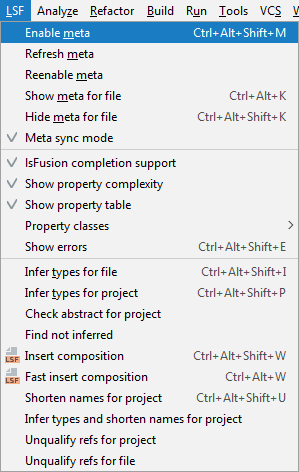

Часто возникает потребность в написании "похожего" кода для определенных случаев. Для этой цели существует [инструкция META](META_instruction.md), которая позволяет создавать некий шаблон кода, называемый *метакодом*. В нем можно использовать параметры, которые затем будут заменяться на определенные значения при использовании этого метакода. Такой подход называется [метапрограммирование](Metaprogramming.md).

Рассмотрим задачу создания простого справочника, как описано в статье [How-to: CRUD](How-to_CRUD.md).

import {CodeSample} from './CodeSample.mdx'

<CodeSample url="https://ru-documentation.lsfusion.org/sample?file=UseCaseCRUD&block=sample2"/>

<CodeSample url="https://ru-documentation.lsfusion.org/sample?file=UseCaseCRUD&block=solution2"/>

На основе этого программного кода можно создать следующий метакод :

<CodeSample url="https://ru-documentation.lsfusion.org/sample?file=UseCaseMeta&block=defineobject"/>

Важно отметить, что один метакод может внутри вызывать другой.

Использование метакода осуществляется следующим образом :

<CodeSample url="https://ru-documentation.lsfusion.org/sample?file=UseCaseMeta&block=defineobject"/>

В первом случае, при генерации результирующего кода система заменит все лексемы **id** на *book*, **shortId** на *b*, **caption** на *'Книга'*, а **multiCaption** на *'Книги'*. При этом при использовании склейки \#\# замена будет произведена без изменений, а при использовании \#\#\# первая буква значения будет заменена на заглавную. Сгенерированный код будет выглядеть следующим образом :

<CodeSample url="https://ru-documentation.lsfusion.org/sample?file=UseCaseMetaResult&block=usedefineobject"/>

Для того, чтобы IDE "видела" код сгенерированный метакодами, нужно включить соответствующий режим через пункт меню.

При включенном режиме работы с метакодами сгенерированный код будет автоматом подставляться в исходниках при его использовании.

Любые изменения в нем невозможны, так как будут автоматически затираться IDE. Однако, при коммите изменений в программе в систему контроля версий рекомендуется выключать этот режим, чтобы избежать ненужной истории изменений.

Объекты, созданные при помощи метакода, можно в дальнейшем расширять используя стандартные [механизмы](How-to_Extensions.md).

<CodeSample url="https://ru-documentation.lsfusion.org/sample?file=UseCaseMetaResult&block=extenddefineobject"/>
