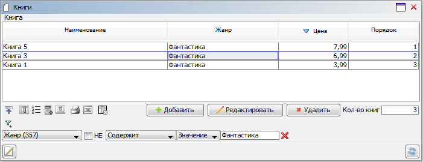

##### Пример 1

###### Условие

Заданы понятия книг, для которых определены наименование, жанр и цена.

import {CodeSample} from './CodeSample.mdx'

<CodeSample url="https://ru-documentation.lsfusion.org/sample?file=UseCaseFormProperties&block=sample1"/>

Нужно вывести на форму количество книг с учетом отборов, сделанных пользователем.

###### Решение

<CodeSample url="https://ru-documentation.lsfusion.org/sample?file=UseCaseFormProperties&block=solution1"/>

Для решения используется оператор [FILTER](Filter_FILTER_.md), который возвращает **TRUE**, если объект находится в текущей отборе на форме.

##### Пример 2

###### Условие

Аналогично **Примеру 1**.

Нужно вывести в таблицу с книгами порядковый номер книги в текущем отборе и сортировке, сделанными пользователем.

###### Решение

<CodeSample url="https://ru-documentation.lsfusion.org/sample?file=UseCaseFormProperties&block=solution2"/>

Свойство с текущим порядком, определяемое при помощи оператора [ORDER](Order_ORDER_.md), не выделяется в отдельное именованное свойство, а используется непосредственно в выражении.

Полученная в обоих примерах форма с заданными пользователем отбором и сортировкой будет выглядеть следующим образом :

