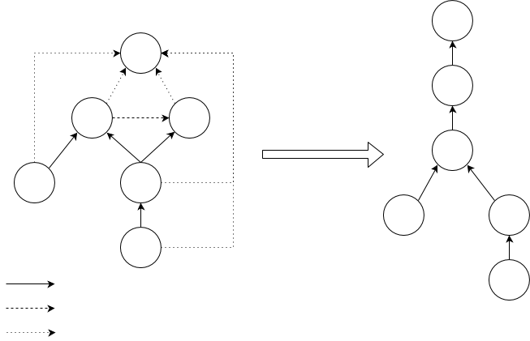

В *статичном* представлении все данные формы читаются на момент ее [открытия](Open_form.md), после чего полученные данные преобразуются:

-   либо в [печатное](Print_view.md) представление - изображение или excel. Печатное представление также часто принято называть *отчетом*
-   либо в [структурированное](Structured_view.md) представление - один из соответствующих форматов данных (например **XML**, **JSON**, **CSV**, **DBF**)

Структурированное представление, как правило, используется для загрузки данных в другие информационные системы, печатное же представление - для просмотра данных пользователем и печати на принтере.

### Пустая группа объектов {#empty}

В статичном представлении для любой формы существует предопределенная *пустая* группа объектов, которая считается первой группой объектов на форме, не содержит ни одного объекта и, считается [группой отображения](Form_structure.md#drawgroup-broken) свойств / фильтров без параметров. Соответственно, в этой группе отображения всегда максимум один пустой набор объектов (ровно один, если нет фильтров без параметров).

### Иерархия групп объектов {#hierarchy}

Для отображения информации в статичном представлении [группы объектов](Form_structure.md) формы необходимо организовать в *иерархию*, в рамках которой данные для групп объектов будут своего рода "вкладываться" друг в друга. К примеру, если у нас есть группы объектов **A** и **B, **и **A **является *родителем* **B**, то отображая эту информацию в статичном представлении сначала будут отображаться все свойства **A** для первого набора объектов из **A**, затем все свойства **B** и пары (**A**, **B**) для всех наборов объектов из **B**, затем будет отображаться аналогичная информация для второго набора объектов из **A** и всех наборов объектов из **B** и так далее.

### Построение иерархии **групп объектов**

Платформа строит иерархию групп объектов на основании [структуры формы](Form_structure.md) следующим образом:

-   Сначала строятся связи между группами объектов по следующим правилам:
    -   группа объектов **A** *зависит* от группы объектов **B**, если **А** в списке групп объектов позднее **B**, и на форме существует свойство или фильтр, которые используют объекты из **A** и **B** в качестве входных аргументов (при этом **B** не должно быть [группой-в-колонки](Form_structure.md#groupcolumns-broken) этого свойства).
    -   любая группа объектов **A** зависит от пустой группы объектов
    -   группа **A** *косвенно зависит* от группы **B**, если, опять таки, **A** позднее **B**, и существует группа объектов **C**, которая зависит и от **A** и от **B**

-   После того как связи построены, иерархия строится таким образом, что родителем группы объектов **A** выбирается наиболее поздняя в списке групп объектов группа **B**, от которой **A** зависит (напрямую или косвенно).

Как следует из алгоритма пустая группа объектов всегда является единственной корневой группой построенной иерархии

### Пример построения иерархии ****групп объектов****

import {CodeSample} from './CodeSample.mdx'

<CodeSample url="https://ru-documentation.lsfusion.org/sample?file=GroupHierarchySample"/>

Иерархия групп объектов для этой формы будет построена следующим образом:

  
