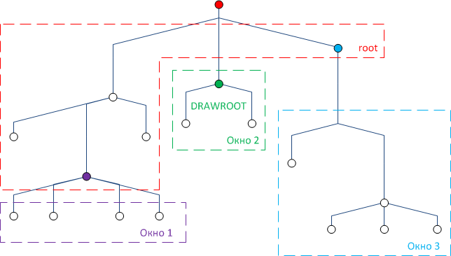

*Дизайн навигатора* определяет то, каким образом навигатор будет отображаться пользователю на экране используемого им устройства (будем называть пространство экрана, на котором отображается навигатор, *рабочим столом*).

Дизайн навигатора состоит из множества *окон -* компонентов рабочего стола,* *каждый из которых отображает некоторые элементы [навигатора](Навигатор.md). 

Для каждого окна должен быть задан *заголовок*, который будет использоваться при отображении окна в пользовательском интерфейсе.

### Расположение элементов навигатора в окнах

Каждому элементу навигатора можно задать, в какое окно должны рисоваться его потомки. При необходимости, в него может рисоваться и сам элемент. Таким образом, для каждого окна однозначно определяется множество *поддеревьев* *элементов* навигатора, которое в нем отображается. Графически это можно представить следующим образом :

### Расположение окон на рабочем столе

Каждое окно занимает предопределенный участок рабочего стола. Графически это можно представить следующим образом :

|
Окно 1
 
 
|
|---|
|
        Окно 2        
 
 
|  Окно 4    |
| | | | | | | |
| | | | | | | |
| | | | | | | |
| | | | | | | |
| | | | | | | |
|  Окно 3      | | | | | | | |
| | | | | | | |
| | | | | | | |

Весь рабочий стол имеет размеры 100x100 *точек*. При создании окна необходимо указать левую верхнюю координату, ширину и высоту окна, выраженную в *точках*. Желательно, чтобы окна "накрывали" всю область рабочего стола. Если этого не происходит, то свободная область будет отдана одному из окон (не гарантируется какому именно). Также допускается, чтобы два окна имели абсолютно идентичные координаты и размеры. В таком случае они будут отображаться на одном и том же месте, но переключение между ними будет идти при помощи вкладок.

### Выбранная папка {#selectedfolder}

В любой момент времени в каждом окне может быть одна текущая *выбранная* пользователем папка навигатора. Соответственно, если элемент навигатора принадлежит окну, отличному от окна его родительской папки, то этот элемент показывается в своем окне в том и только в том случае, если его родительская папка является выбранной в своем окне. Предопределенная папка **System.root** всегда считается выбранной. Если в каком-то окне не должен отображаться ни один элемент навигатора, то это окно автоматически прячется.

### Типы

Для каждого окна* *может быть выбран *тип*, в зависимости от которого будет определяться, какой компонент в интерфейсе будет использоваться для отображения элементов навигатора.

-   *Тулбар* - контейнер, состоящий из кнопок, каждая из которых соответствует одному элементу навигатора. Вертикальный тулбар располагает все кнопки сверху вниз, делая отступы слева для каждого элемента в зависимости от его положения в дереве. Горизонтальный тулбар располагает кнопки слева направо, не делая при этом никаких отступов.
-   *Панель* - контейнер, в котором элементам навигатора соответствует иерархия компонент, где для [форм](Формы.md) и *[действий](Действия.md)* созданы кнопки, а папкам навигатора - вложенные контейнеры с соответствующим заголовком. Вертикальная панель располагает все вложенные контейнеры и кнопки в них сверху вниз, а горизонтальная - слева направо.
-   *Дерево - *дерево, в котором каждому узлу соответствует свой элемент навигатора.
-   *Меню* - меню, в котором каждой папке навигатора соответствует всплывающее меню, а формам и действиям - пункты в этом меню.

По умолчанию, в пользовательском интерфейсе компонент, который отображает элементы навигатора, оборачивается в скроллбары. Они появляются в случае, когда компонент не помещается в окне. При необходимости данное поведение можно отключить.

### Системные окна

Существует несколько предопределенных системных окон, которые необходимы для работы клиентского приложения :

-   **forms** - окно, в котором будут открываться все пользовательские формы.
-   **log** - окно, в которое будут выводиться все сообщения пользователю. Если это окно будет невидимо, то сообщения будут выдаваться пользователю в виде системных диалоговых форм.
-   **status -** окно, в которое выводится различная системная информация.

Также, для удобства разработки, автоматически создаются три дополнительных окна :

-   **root -** горизонтальный тулбар, в который рекомендуется отображать непосредственные потомки элемента навигатора* ***root**. В этом окне по умолчанию отображается папка навигатора **System.root**.
-   **toolbar-** вертикальный тулбар*,* в который рекомендуется отображать часть потомков элементов навигатора, которые отображаются в окне **root**.
-   **tree** - дерево, в которое рекомендуется отображать часть потомков элементов навигатора, которые отображаются в окне* ***root**

### Расположение по умолчанию

По умолчанию, рабочий стол имеет следующее расположение (в скобках указаны левая координата, верхняя координата, ширина, высота) :

|<strong>root</strong> (0, 0, 100, 6)|
|---|
|
<strong>  </strong>
 
<strong>toolbar/tree</strong>
 
(0, 6, 20, 64)
 
 
|
 
 
 
 
<strong>forms</strong> (20, 20, 80, 79)
 
 
|
|
<strong>log</strong>
 
(0, 70, 20, 29)
|
|<strong>status</strong> (0, 99, 100, 1)|

### Язык

Для управления окнами необходимо использовать [инструкцию **WINDOW**](Инструкция_WINDOW.md).

### Примеры

import {CodeSample} from './CodeSample.mdx'

<CodeSample url="https://ru-documentation.lsfusion.org/sample?file=InstructionSample&block=window"/>

  
