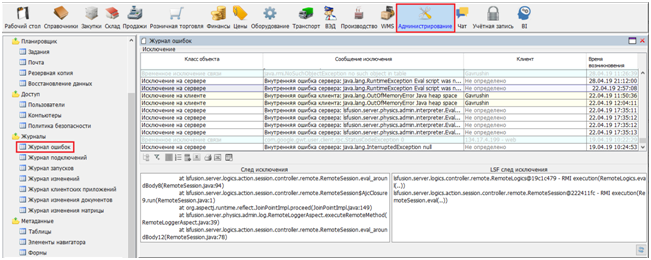
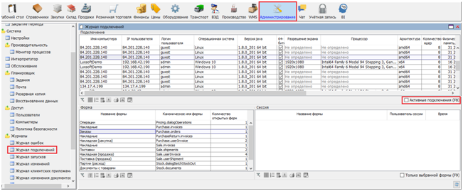
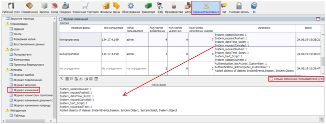
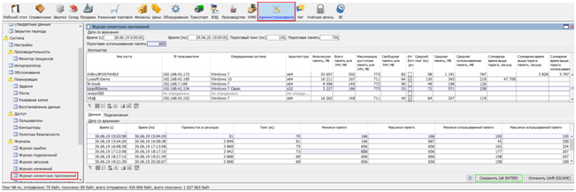
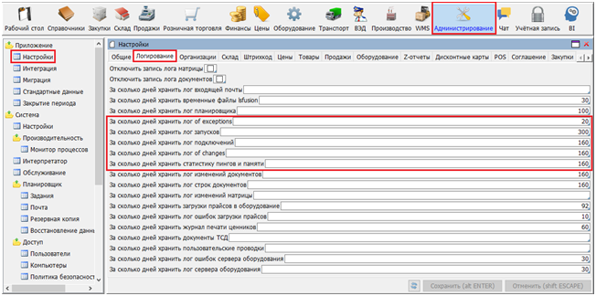
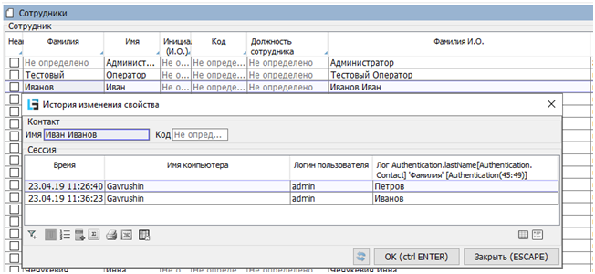

### Журналы

-   Журнал ошибок (рис.1).

Данный журнал содержит все ошибки, возникшие в ходе работы. Ошибки делятся на следующие классы (колонка «Класс объекта»):

-   ошибки, возникшие на сервере –– ошибки отображены на белом фоне и входят в единственный класс «Исключение на сервере»;
-   ошибки, возникшие на сервере и полученные клиентским приложением –– ошибки отображены на розовом фоне и входят в единственный класс «Исключение на сервере (от клиента)»;
-   ошибки, возникшие на клиентском приложении – ошибки отображены на желтом фоне и входят в два класс: «Исключение на клиенте» и «Исключение на web-клиенте»;
-   ошибки связи – ошибки отображены на голубом фоне и входят в два класса:
    -   «Временное исключение связи» - связь с сервером прерывалась, но была восстановлена;
    -   «Постоянное исключение связи» - связь с сервером прерывалась и не восстановилась;

 Рис. 1 Журнал ошибок.

В секции «След исключения» отображается java-стек ошибки, в секции «LSF след исключения» - lsfusion-стек. 

-   Журнал подключений (рис. 2).

** **

Рис. 2 Журнал подключений.

В журнале храниться информация о пользователях, которые подключались к системе, с какого компьютера, каковы характеристика этого ПК, а также информация о дате и времени подключения/отключения. На форме можно отобразить пользователей, работающих в данный момент с БД – отметка «Активные подключения».

В секции «Форма» видно сколько раз и в какие формы входил пользователь. В секции «Сессия», для некоторых форм, можно проследить, когда применялись изменения.

-   Журнал запусков хранит информацию о дате и времен запуска (перезапуска) сервера приложений. Также видно имя компьютера, на котором установлен сервер и версия приложения (если заполняется при сборке).

<!-- -->

-   Журнал изменений содержит более подробную информацию о примененных изменениях, которые были отражены в Журнале подключений в секции «Сессия» (рис. 3.).

Рис. 3 Журнал изменений.

В колонке «Изменения» отображается список Свойств (колонок), в которых менялись значения, а также количество изменений (строк). Логируются только изменения на текущей форме – зависимые Свойства, которые меняются одновременно на других таблицах, в данный список не попадают.

На форме можно отфильтровать изменения, сделанные пользователями (без системных изменений) – отметка «Только изменения пользователя».

-   Журнал клиентских приложений содержит информацию о качестве соединения во время работы с сервером приложений за определенный период времени (рис. 4.).

Рис. 4 Журнал клиентских приложений.

В верхней части формы для клиентских компьютеров, помимо системных показателей памяти, можно проанализировать средние значения времени отклика (ping) в миллисекундах, доступной и используемой java-приложением памяти. Анализируемый период задается вводом «Дата с» и «Дата по» в секции «Дата со временем». Кроме дат, здесь можно задать пороговый значения для этих же показателей (ping и память)– это позволит получить суммарно время (в секундах), когда клиентский ПК превысил пороговые значения.

В нижней части, на вкладке «Данные» представлена хронология изменений времени отклика, доступной и используемой памяти. Эта информация отображается только для Desktop-клиента.

Сколько должна храниться информация в перечисленных журналах указывается на форме Администрирование\\Настройки\\вкладка Логирование (рис. 5.).

Рис. 5 Установка количества дней логирования.

Если необходимо отслеживать изменения отдельных значений в каких-либо  Свойствах (колонках), на определенных Формах, для таких случаем разработан механизм пользовательского логирования. Например, в справочнике Сотрудники нужно протоколировать изменения фамилии сотрудника. Для этого:

1.  находясь на любой записи колонки «Фамилия», по правой клавише мыши вызываем меню «Настройка политики свойств» (рис. 6.);

Рис. 6 Выбор свойства для протоколирования изменений.

-   в форме «Политика безопасности» устанавливаем отметку «Логируется пользователем» и нажимаем кнопку «ОК» (рис. 7.);

Рис. 7 Установка пользовательского логирования.

-   после перезапуска сервера приложений, при нажатии правой клавиши мыши на Свойстве «Фамилия», появится дополнительный пункт меню «Показать историю изменений». Если, для текущей записи, фамилия была кем-то изменена, то это найдет отражение в истории изменения свойств (рис. 8).

### 

Рис. 8. История изменения свойства.

Время хранения для подобных протоколов устанавливается одинаковым времени хранения для Журнала изменений.

### Логи

Для каждого компонента платформы в платформе поддерживается следующий набор логов:

|Компонент|Папка|Логи|
|---|---|---|
|Сервер приложений (Server)|$FUSION_DIR$/logs, где $FUSION_DIR$ - папка запуска сервера приложений|
 <ul> <li>stdout - лог стандартного вывода (выводится в стандартный поток вывода, то есть в консоль ОС, IDE и т.п.). Включает в себя логи start и explain.</li> <li>stderr - общий лог ошибок</li> <li>start - лог процесса остановки и запуска</li> <li>remote, invocation - логи процессов связанных с обращением к серверу приложений</li> <li>sql, sqlhand, sqlconnection, sqlconflict, sqladjust - логи процессов связанных с обращением к серверу бд</li> <li>explain, explaincompile - логи, в которые выводятся планы запросов (сервера БД и сервера приложений соответственно)</li> <li>lru - лог процессов управления памятью (в основном LRU кэшами)</li> <li>allocatedbytes - лог процессов выделения памяти</li> <li>assert - лог различных проверок на выполнение заданных условий (а точнее их невыполнение)</li> <li>mail - лог почты</li> <li>jasperReports - лог JasperReports</li> <li>jdbc - лог jdbc-драйвера</li> <li>exinfo - лог дополнительной информации (не входящей в вышеописанные)</li> </ul> 
|
|Веб-сервер (Client)|$CATALINA_BASE$/logs,  где $CATALINA_BASE$ - папка, в которую установлен Tomcat|<ul> <li>catalina.out - общий лог вывода</li> <li>gwtlog, gwtlog-err - логи GWT</li> <li>invocation - логи процессов связанных с обращением к веб-серверу</li> </ul>|
|Десктоп-клиент|$USER_DIR$/.fusion/logs, где $USER_DIR$ - папка пользователя|<ul> <li>stdout - лог стандартного вывода (выводится в стандартный поток вывода, то есть в консоль ОС, IDE и т.п.).</li> <li>stderr - общий лог ошибок</li> <li>remote, invocation - логи процессов связанных с обращением к серверу приложений</li> <li>jasperReports - лог JasperReports</li> </ul>|

  

При [автоматической установке](Выполнение_авто.md) под Linux для этих папок (как и для файлов [lsFusion параметров запуска](Параметры_запуска.md#lsfusion)) автоматически создаются symlink'и на [другие папки](Выполнение_авто.md#Выполнение(авто-broken)-logs), расположение которых лучше соответствует идеологии Linux.
