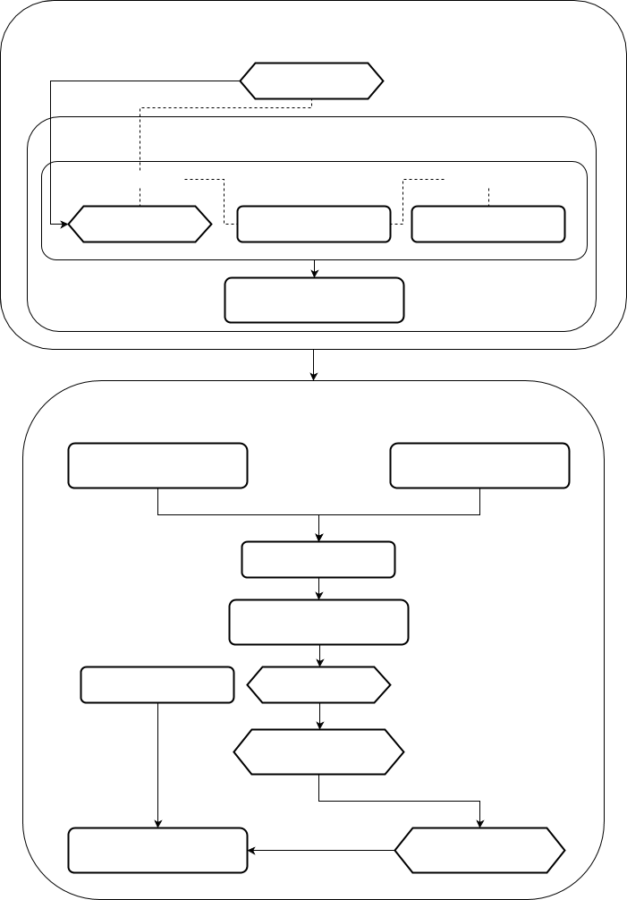

Логическая модель традиционно делится на две части:

[Логика предметной области](Логика_предметной_области.md)

Определяет какую информацию хранит система, и что с этой информацией можно делать. Эту логику также часто называют бизнес-логикой.

[Логика представлений](Логика_представлений.md)

Включает в себя все то, что связано с отображением информации субъектам, использующим информационную систему – пользователям и другим информационным системам.

### Стек

**  
**

