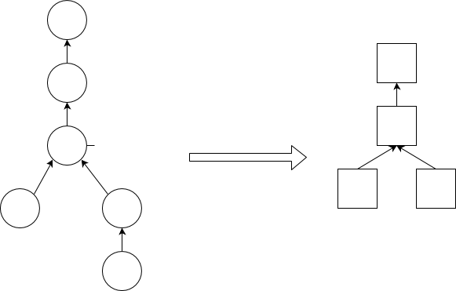

Печатное представление [формы](Формы.md) состоит из набора шаблонов (*отчетов*), при подстановке данных в которые происходит формирование *документа* в графическом формате (с пиксельным позиционированием) или псевдографическом (с позиционированием по ячейкам). Этот документ отображается пользователю при помощи специального графического компонента, внутри которого пользователь может осуществлять навигацию по страницам, приближение/отдаление внутри страниц, а также выводить содержимое компонента на печать или экспортировать в различные форматы (например PDF или Excel). При необходимости отображение компонента пользователю можно пропустить, и сразу отправить документ на печать или сохранить в выбранный файл в заданном формате.

Для каждого отчета определяется набор [групп объектов](Структура_формы.md#objects) формы, которые он будет отображать.

### Иерархия отчетов

Также как и у группы объектов, у каждого отчета есть *родительский* отчет, таким образом все отчеты образуют иерархию. При этом иерархия отчетов должна :

-   включать в себя [иерархию групп объектов](Статичное_представление.md), то есть если группа объектов одного отчета является потомком группы объектов второго отчета,  то первый отчет должен совпадать со вторым отчетом или также являться его потомком
-   внутри одного отчета у каждой группы объектов должен быть ровно один потомок.

### Построение иерархии отчетов {#buildhierarchy}

Как следует из ограничений на иерархию отчетов, в один отчет можно включать только "цепочки" групп объектов (то есть, G1, G2, G3, ... Gn,  где G2 - единственный прямой потомок G1, G3 - единственный прямой потомок G2 и т.д.). Соответственно решение о том, как разбивать группы объектов на отчеты сводится к тому, надо ли сливать группу объектов с ее единственным прямым потомком (при наличии такого) или нет. По умолчанию, такое слияние выполняется, однако, при необходимости, разработчик может запретить его задав соответствующую опцию (**SUBREPORT**) для группы объектов-потомка.

Использование этой опции сводится к тому, нужно ли отображать данные для группы объектов-родителя при отсутствии данных в группе объектов-потомке.

### Пример построения иерархии отчетов

Форма такая же как и в [примере построения иерархии групп объектов](Статичное_представление.md#hierarchysample-broken):

import {CodeSample} from './CodeSample.mdx'

<CodeSample url="https://ru-documentation.lsfusion.org/sample?file=GroupHierarchySample"/>

Иерархия отчетов для этой формы будет построена следующим образом:

  

### Язык

Использование всех вышеперечисленных возможностей, как и задание структуры формы, осуществляется при помощи [инструкции **FORM**](Инструкция_FORM.md).

### Открытие формы

Для отображения формы в печатном представлении используется соответствующий оператор [открытия формы](Открытие_формы.md) в [печатном представлении](В_печатном_представлении_PRINT.md).

### Примеры

<CodeSample url="https://ru-documentation.lsfusion.org/sample?file=ActionSample&block=print"/>
