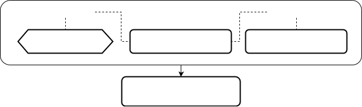

Формы позволяют объединять различную информацию для одного или нескольких объектов в одном интерфейсе. Логически форму можно разделить на две части:

-   [Структура формы](Структура_формы.md)  - определяет, какую именно информацию (**что**) отображать пользователю.
-   [Представления формы](Представления_формы.md) - определяет, в каком виде (**как**) это нужно сделать.

В пользовательском интерфейсе открытие формы происходит в случае выбора соответствующего элемента в [навигаторе](Навигатор.md) или выполнения действия, созданного при помощи [специального оператора](Открытие_формы.md).

### Стек

**  
**

